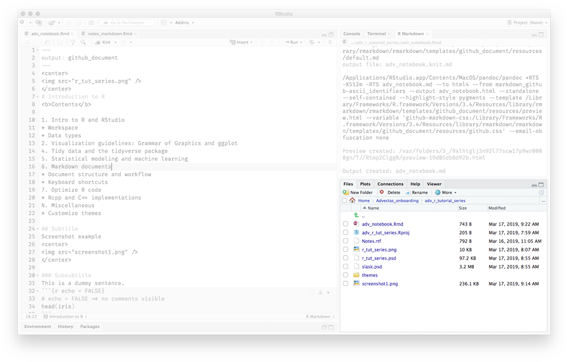
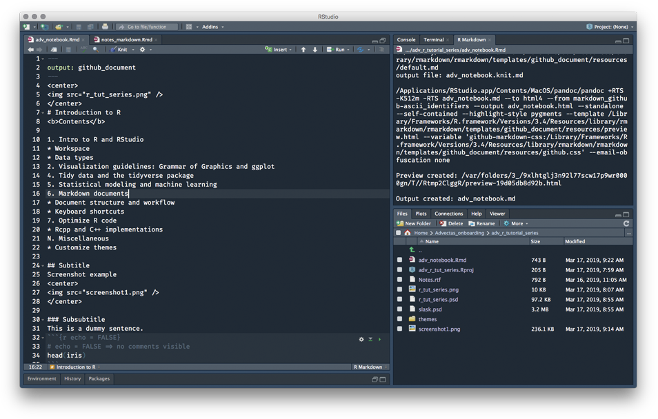

<center>

</center>

## Introduction to R

###<b>Contents</b>

1. <b>Intro to R and RStudio</b>
    * Workspace
    * Data types

2. <b>Visualization guidelines: Grammar of Graphics and ggplot</b>

3. <b>Tidy data and the tidyverse package</b>

4. <b>Statistical modeling and machine learning</b>

5. <b>Markdown documents</b>
    * Document structure and workflow
    * Keyboard shortcuts

6. <b>Optimize R code</b>
    * Rcpp and C++ implementations

N. <b>Miscellaneous</b>
* Customize themes

## Subtitle
Screenshot example
<center>


</center>

This is a dummy sentence.
```{r echo = FALSE}
# echo = FALSE => no code visible
head(iris)
```

<b>Session info (for reproducibility)</b>
```{r}
sessionInfo()
```

