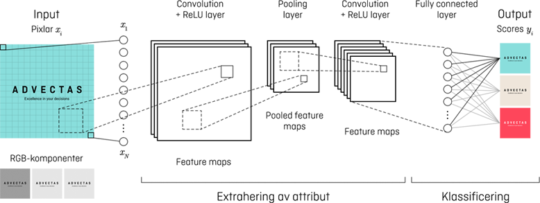
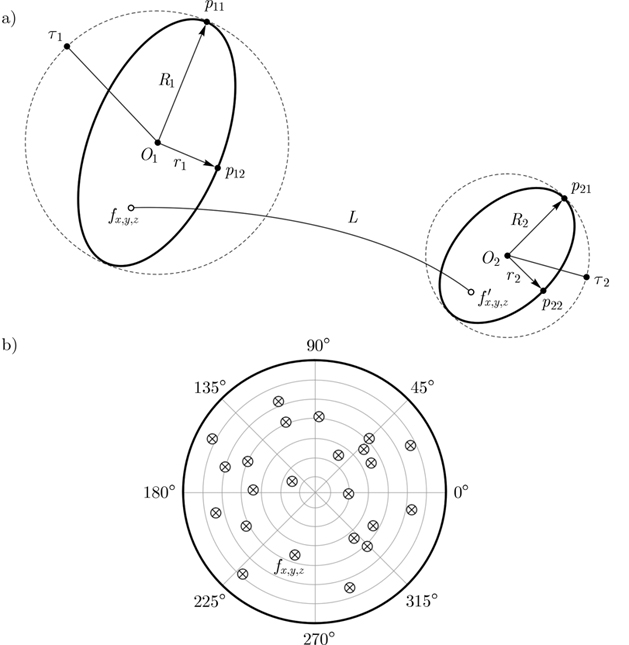

<center></center>

# Title

### Contents

1. <b>Intro to R and RStudio</b>
    * Workspace
    * Data types

2. <b>Visualization guidelines: Grammar of Graphics and ggplot</b>

3. <b>Tidy data and the tidyverse package</b>

4. <b>Statistical modeling and machine learning</b>

5. <b>Markdown documents</b>
    * Document structure and workflow
    * Keyboard shortcuts

6. <b>Optimize R code</b>
    * Rcpp and C++ implementations

6. <b>Another section</b>
    * Subcategory
    
6. <b>Another section</b>
    * Subcategory

7. <b>Miscellaneous</b>
* Customize themes

## Subtitle
The idea is to partition DLNotebook into different "tutorial" sections. This file serves as a guideline for writing markdown documents on topics included in the Advectas onboarding process.

<b>Illustration examples</b>

<center></center>
<br>
<br>
<p align="center"></p>

<b>Figure N.</b> Fiducial placement and fiber definition. a) Placing two consecutive elliptical fiducials entails specifying the center points. b) Uniformly distributed fibers in a circular fiducial of radius $R_1$.

<b>Screenshot examples</b>

<center></center>

This is a dummy sentence.
```{r echo = TRUE}
head(iris)
```

<b>Session info (for reproducibility)</b>
```{r}
sessionInfo()
```

