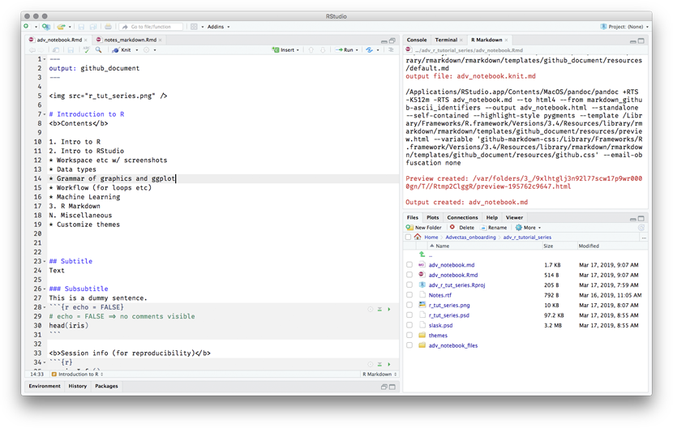

<center>

</center>
# Introduction to R
<b>Contents</b>

1. Intro to R
2. Intro to RStudio
* Workspace etc w/ screenshots
* Data types
* Grammar of graphics and ggplot
* Workflow (for loops etc)
* Machine Learning
3. R Markdown
N. Miscellaneous
* Customize themes


## Subtitle
Text

### Subsubtitle
This is a dummy sentence.
```{r echo = FALSE}
# echo = FALSE => no comments visible
head(iris)
```
<center>

</center>
<b>Session info (for reproducibility)</b>
```{r}
sessionInfo()
```

