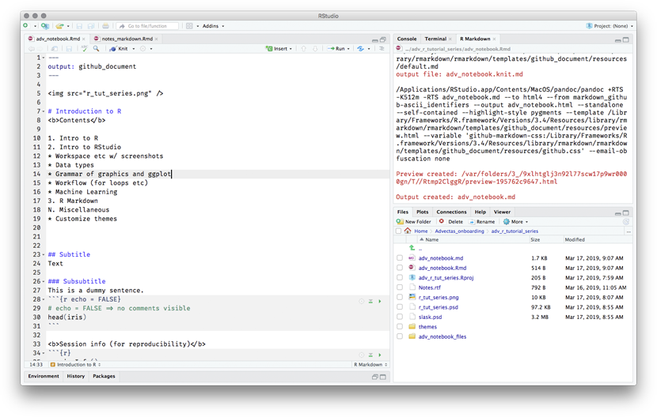

<center>

</center>
Introduction to R
=================

<b>Contents</b>

1.  Intro to R
2.  Intro to RStudio

-   Workspace etc w/ screenshots
-   Data types
-   Grammar of graphics and ggplot
-   Workflow (for loops etc)
-   Machine Learning

1.  R Markdown N. Miscellaneous

-   Customize themes

Subtitle
--------

Text

### Subsubtitle

This is a dummy sentence.

    ##   Sepal.Length Sepal.Width Petal.Length Petal.Width Species
    ## 1          5.1         3.5          1.4         0.2  setosa
    ## 2          4.9         3.0          1.4         0.2  setosa
    ## 3          4.7         3.2          1.3         0.2  setosa
    ## 4          4.6         3.1          1.5         0.2  setosa
    ## 5          5.0         3.6          1.4         0.2  setosa
    ## 6          5.4         3.9          1.7         0.4  setosa

<center>

</center>
<b>Session info (for reproducibility)</b>

``` r
sessionInfo()
```

    ## R version 3.4.2 (2017-09-28)
    ## Platform: x86_64-apple-darwin15.6.0 (64-bit)
    ## Running under: macOS High Sierra 10.13.6
    ## 
    ## Matrix products: default
    ## BLAS: /Library/Frameworks/R.framework/Versions/3.4/Resources/lib/libRblas.0.dylib
    ## LAPACK: /Library/Frameworks/R.framework/Versions/3.4/Resources/lib/libRlapack.dylib
    ## 
    ## locale:
    ## [1] C
    ## 
    ## attached base packages:
    ## [1] stats     graphics  grDevices utils     datasets  methods   base     
    ## 
    ## loaded via a namespace (and not attached):
    ##  [1] compiler_3.4.2  backports_1.1.2 magrittr_1.5    rprojroot_1.3-2
    ##  [5] tools_3.4.2     htmltools_0.3.6 yaml_2.2.0      Rcpp_1.0.0     
    ##  [9] stringi_1.2.4   rmarkdown_1.9   knitr_1.22      xfun_0.5       
    ## [13] stringr_1.3.1   digest_0.6.13   evaluate_0.10.1
